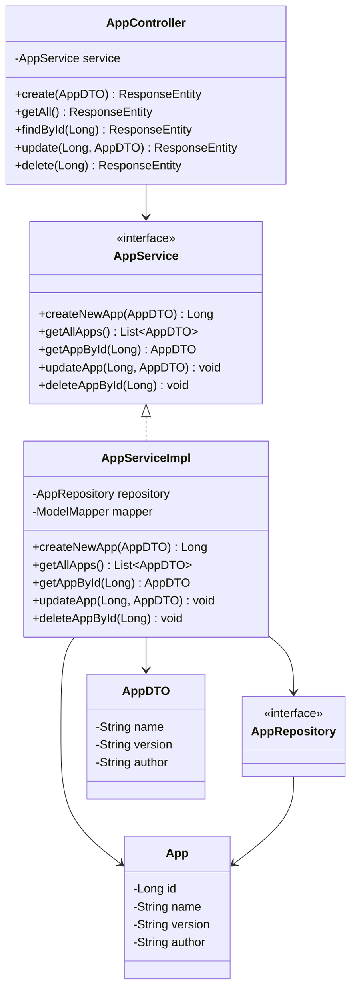
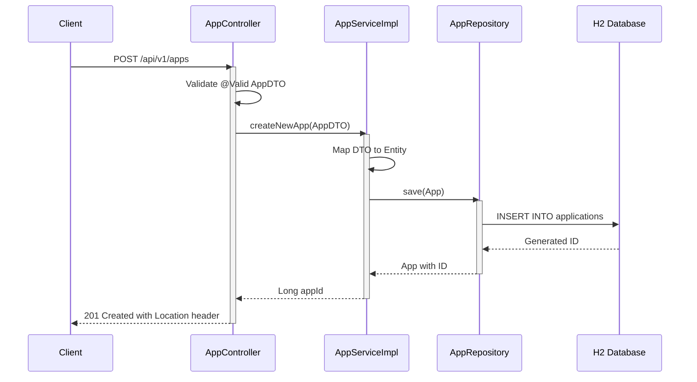
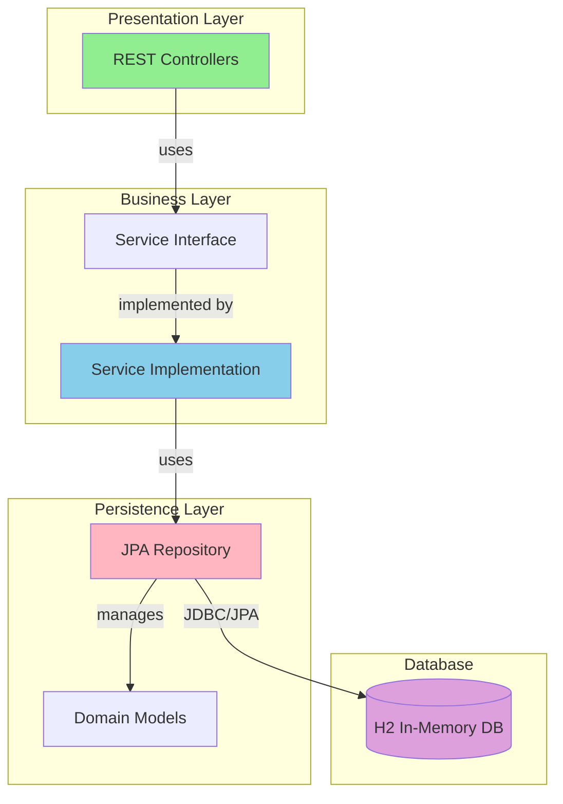

# Spring Boot CRUD REST Application - Technical Documentation

## Project Overview

This is a Spring Boot CRUD REST application built with Java 21.

## Architecture Diagrams

## Project Structure

### Controllers
- `AppController.java` - src/main/java/com/apka/tech/buddy/controller/AppController.java

### Services
- `AppService.java` - src/main/java/com/apka/tech/buddy/service/AppService.java

### Repositories
- `AppRepository.java` - src/main/java/com/apka/tech/buddy/repository/AppRepository.java

### Domain Models

### DTOs

*Note: Set OPENAI_API_KEY environment variable for AI-enhanced documentation*
