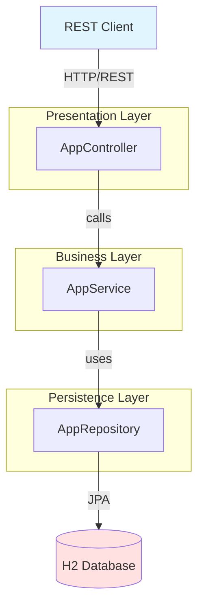
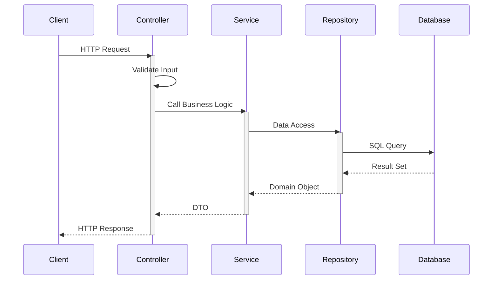

# Spring Boot CRUD REST Application
## Technical Documentation
### Generated with GitHub Copilot

---

The gh-copilot extension has been deprecated in favor of the newer GitHub Copilot CLI.

For more information, visit:
- Copilot CLI: https://github.com/github/copilot-cli
- Deprecation announcement: https://github.blog/changelog/2025-09-25-upcoming-deprecation-of-gh-copilot-cli-extension

No commands will be executed.

---

The gh-copilot extension has been deprecated in favor of the newer GitHub Copilot CLI.

For more information, visit:
- Copilot CLI: https://github.com/github/copilot-cli
- Deprecation announcement: https://github.blog/changelog/2025-09-25-upcoming-deprecation-of-gh-copilot-cli-extension

No commands will be executed.

---

The gh-copilot extension has been deprecated in favor of the newer GitHub Copilot CLI.

For more information, visit:
- Copilot CLI: https://github.com/github/copilot-cli
- Deprecation announcement: https://github.blog/changelog/2025-09-25-upcoming-deprecation-of-gh-copilot-cli-extension

No commands will be executed.

---

## Component Details

The gh-copilot extension has been deprecated in favor of the newer GitHub Copilot CLI.

For more information, visit:
- Copilot CLI: https://github.com/github/copilot-cli
- Deprecation announcement: https://github.blog/changelog/2025-09-25-upcoming-deprecation-of-gh-copilot-cli-extension

No commands will be executed.

---

The gh-copilot extension has been deprecated in favor of the newer GitHub Copilot CLI.

For more information, visit:
- Copilot CLI: https://github.com/github/copilot-cli
- Deprecation announcement: https://github.blog/changelog/2025-09-25-upcoming-deprecation-of-gh-copilot-cli-extension

No commands will be executed.

---

---

## System Architecture Diagram

## Request Flow Sequence

---

## Project File Structure

### Controllers
- **AppController.java** - `src/main/java/com/apka/tech/buddy/controller/AppController.java`

### Services
- **AppService.java** - `src/main/java/com/apka/tech/buddy/service/AppService.java`

### Repositories
- **AppRepository.java** - `src/main/java/com/apka/tech/buddy/repository/AppRepository.java`

### Domain Models

### DTOs

---

*Generated automatically using GitHub Copilot*
*Date: 2025-11-19 14:03:06*
*Tool: GitHub CLI with Copilot Extension*
